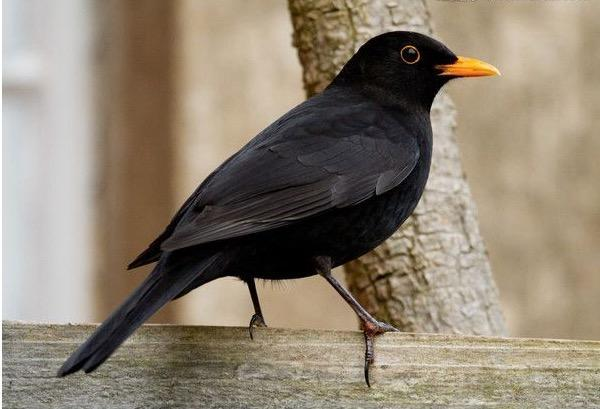
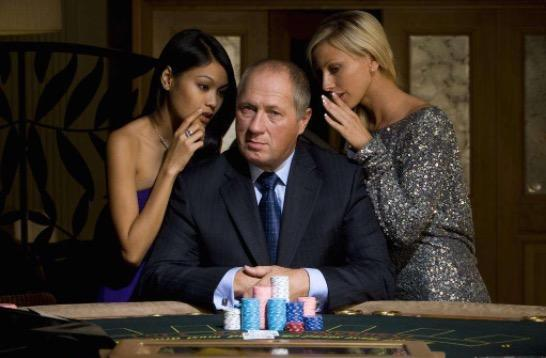
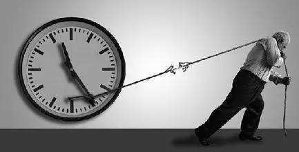

这是一篇旧文，是当时对生活的一种小小感悟，如今写了博客，就搬过来分享一下，其实如今看来，有些内容还不过时，有些稍有陈旧，不过为了保持文字的原汁原味，就不做删改了。
<!--more-->

镇楼图

​    昨天傍晚时分，夕阳的余晖洒满了周围，好想安静无忧的看一会儿这雨后的放晴的世界，可对面学校的楼上来了两只乌鸦，歪着头对着隔壁的小区叫了一大会儿，让我一下子想了许多，突然觉得有些凉意，经过许久的琢磨，有了下文。

​    参加工作这些年，特别是很少写关于职业生涯的工作，主要顾虑到自己的年纪不大，见识短，写出来会如盲人摸象，再者，工作中都比较携带主观感情，很难将心中的“我”从环境里抽离，站到一个更高的视角看。于是我总是在自己偶尔闲余的时候，去思考一些这些年的职业中的所见所闻，所思所感。成功的公司有很多成功的缘由和因素，失败的公司也有许许多多的失败的诱因，成功者手持着成功利剑一路斩将，终于登上了闪耀的舞台，其实或许他们口中的成功秘诀也只是成功后的一种总结。同样失败者亦然，失败了，总结的失败的教训未必是失败的真正的缘由，或许，只是一些臆想的因素。所以接下来我不想谈成功的那些准则，也不想单一的谈失败的那些常犯的错误，我只是对目前我所熟知的的一些词，做一个自己的见解。

​    什么是乌鸦的告诫，就是能够提前感知事物的变化规律，就是我们常说的眼界，对眼界的理解，这个除了天赋，还有一个人过去所有见识智慧的积累，这个没有更好的手段，属于天赋+勤奋+机遇的集合。两个眼界不同的人是很难一起谈未来的，著名的网络上流传的“三季人”的段子，就是如此，和一个感知很差劲的人，一起谈工作项目的变化，如对牛弹琴也。年少的我，以前总是很容易成为那只讨人厌的“乌鸦”，年少因为接触的知识，圈子，书籍，有限，而大多数形而上的东西，儒家思想占据了绝对优势，大概是从28岁开始，更多的接触一些其他的东西，有了佛家，道家，对世界的认知的理解和认知开始变化一些，开始不再多言，静观其变。去过寺庙的人都很容易记得门口的那尊笑呵呵的弥勒佛，却很少关注他背后的手持神器，面目狰狞的金刚，说佛慈悲的，不免显得肤浅了些。

​    时代是变化的，互联网行业的变化更是其他的行业的几倍，如果一个人离开互联网行业两年，等他回过来看时，已经不是当初的那个样子了，我这么说，你是不是很熟悉？是的，这个就是我们小学课本里那边很著名的成语“刻舟求剑”的变种，很多人当初成功了一次，打开了一扇成功的门，就妄想着自己持有了一把打开所有成功门的钥匙，于是步履匆匆的去尝试各种各样的形式，看别人成功了，以为自己也能照搬，偶尔受了对方的劝告，还退给别人一句：“想当年，我也是牛逼过的......” 《三体》里说出了我最想说的，弱小和无知不是生存的障碍，傲慢才是。任何傲慢的狂言，都会被时代碾压的粉碎，面目全非。

​    不管你是自主创业，还是给别人打工，你要警惕那些工作里让你“All In”的人，酒桌上，有些人几杯酒下肚，开始胡言乱语了，给你造梦，给你画饼，给你幻想一个未来，说，小伙子，好好干，不会亏得你的，有时候顺便带点让你恐惧的话，比如，公司，在业界已经算是不错的公司了，某某公司更甚，外面的市场不好，等各种云云。人是很奇怪的，一旦平静下来就会滋生懒惰因子，懒惰让人变得恐惧，害怕无常。其实反观那些身边那些离开的人，其实没有几个如酒桌之言，混的如何不好的，小到职业环境，大到人类环境，我们之所以要进步，究其原因就是不让自己淘汰。如何不让自己被淘汰呢？老祖宗留下了一套哲学，就是竞争，和时间赛跑，和周围赛跑，你只要比周围的人跑的快，变化的快，就能不被环境淘汰，苦心人，天不负。

​    人类简史里有一个细节值得注意，就是说人类是一种善于撒谎的物种，欺骗，不否认，我们的周围充斥着各种披着华丽外衣的谎言，人生苦短，如果一个人想成大事，必须依靠外部力量，一种最直接的方法，就是造梦，给别人造梦，让他人以为是“我们”，其实在胜利果实瓜熟蒂落的时候，才知道只自己并不在“我们”之列，充其量只是那个围着磨盘永远吃不到胡萝卜的小驴。世界是公平的，而又是不公平的，公平和不公平没有一把大家公认度量的尺子，卑鄙是卑鄙者的通行证， 高尚是高尚者的墓志铭。很多公司都会搞出一套企业文化，而每个企业的文化都各不相同，不是说你说诚实是公司文化，它就是公司文化，公司文化是一种反馈的东西，必须有长期不断的渗透。

​    接下来说说战略和战术的论述，很多时候，战略的制定决定了方向，战术的制定决定了如何去实现。比如说，我们决定100个人往南走，到达1000公里的地方。往南走是战略，如何走1000里到达，是战术。愚蠢的制定者是这样算的，假如一个人一小时走10公里，那么100个小时后可以到达，如果我们每天走10个小时，那么10天后到达，既然有了战略和战术，那我们出发吧！这样的制定，后果，你懂的。聪明的制定者会考虑很多，人性，天气，交通工具，方向偏离等等。

​    其实无论是战略的失败还是战术的失败都绝对会导致结果的失败。于是乎衍生了一直偷懒模式，这个模式叫做以结果为导向，初看起来这个没啥毛病，这个不是和小平同志的“黑猫，白猫，逮着老鼠才是好猫”的理论不谋而合啊。如果一个企业喜欢以结果为导向，就会有欺上瞒下，内斗的现象，为了达到目的，不择手段。正是楚王好细腰，宫中多饿死。如果一个老板喜欢体育运动，公司肯定会有一股体育文化，老板喜欢加班，你放心，每逢节假日，必定有人冲锋陷阵。你的爱好，决定了你的生活，老板的爱好，决定了一个公司的文化。有人说了，我看微波粼粼，哪有你说的那么严重啊，哈哈，我只能对这样的人，笑而不语。有人的地方就有江湖，人在江湖，身不由己这个道理我想凡是经过世事的人都明白，你可以做那个被人卖了还帮别人数钱的傻子，他就会做那个视而不见的瞎子。

   乌鸦的告诫，有几种，比如《谏太宗十思疏》里那句“善始者实繁 克终者盖寡”，再如《孟子见梁惠王》的“苟为后义而先利，不夺不餍。未有仁而遗其亲者也，未有义而后其君者也。王亦曰仁义而已矣，何必曰利？”或者是《扁鹊见蔡桓公》里的那句：“君有疾在腠理，不治将恐深。”亦或者是《孟子·公孙丑下》的“得道者多助，失道者寡助。”自古以来，能告诫者着实不多，而告诫者里面有远见卓识甚少，而能听告诫的人更是凤毛麟角。所以很多人最后悟道了，慢慢了理解了这些规律，就知道不再跟世界为敌，开始学会顺势而为。有时候，既然无法渡人，那就先尝试着渡己吧。

​    俗话说得好，喝醉酒的人都会说自己没醉，叫不醒的都是装着睡着的人，自己的人生还得自己掌舵，做自己的船长吧，干嘛非要做他人屋顶的乌鸦呢？天色已经暗去，远处的火烧云也没有了，路灯亮了，城市的夜开始了！

