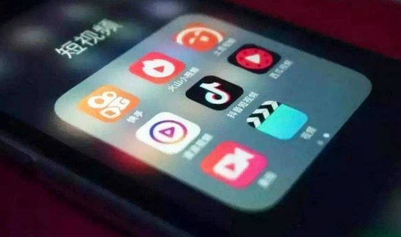
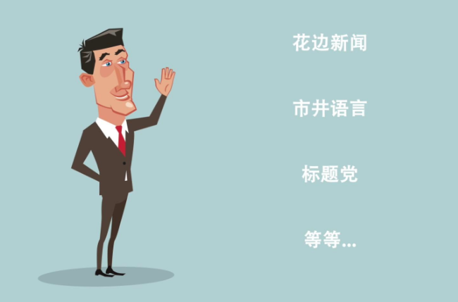
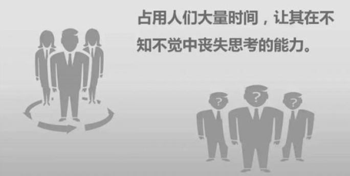
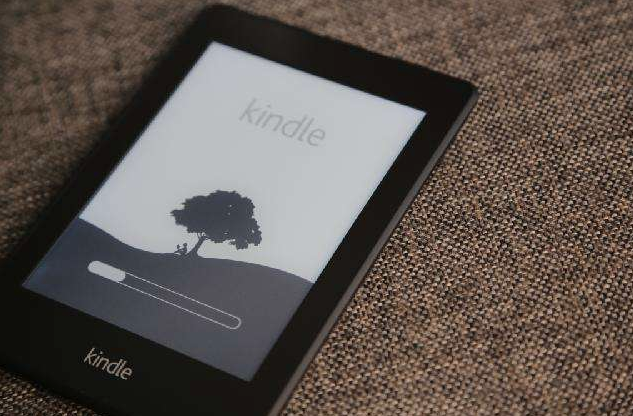

这个时代，多媒体只是帮助阅读和理解这个世界更容易，而不是让他们带我们走进他们安排的时间，有时候不发声，是不同意周围的声音，恰好还没有找到更合适的观念。
<!--more-->

这几年造成了影荒，剧荒,特别是自媒体发展后紧接着就是官媒入场，信息得以在短时间内发生和传播，但是与此同时，伴随着数据造假，货品造假，价格造假，真相被掩盖，事实被剪辑，被修改。前几年炒的很热的大数据，并不全是来服务百姓的生活，而是用来分析如何猎杀百姓的钱包，引导百姓的生活，万众期待的美好并未出现，而劣迹斑斑的公司却一次又一次的挑战公众的底线。流行的东西未必都是倡导的东西，流行的东西很多反而是未经审视和思考的结果，于是媒体一次又一次的降低文化输出的门槛，从免费开始，文字，图片，语音，视频模板开始，一步步的让更多的人参与进来，这是一场高维选手无奈陪跑低维选手的一场运动。

显然，资本再一次的胜利了，资本追逐的是人们的时间和精力，从各种触觉，视觉，听觉，味觉各个方面入手，围猎大众，我们面临着难以吃到健康绿色的食物和水，难以穿到纯生物制品的衣服和生活用品，商人是逐利的，马克思说过:"资本来到世间，从头到脚，每个毛孔都滴着血和肮脏的东西"可如今面对偌大的资本市场，人们更多的是处于弱势，难以反抗，如果没有更好的监管，面临的是更多的是宰杀。

夕阳的湖面

节前短袖，假期一场秋雨，节后就是略有寒意秋天了，这几天算得上北京入冬前比较晴朗干爽的日子，近几个月一直忙于生活，忙于工作学习，很少有时间来思考生活，假期在屋里待着，看了许多短视频，结合这几天的所思所想，谈谈这半年和一些感悟。

先说说，很多人都喜欢的短视频，代表有抖音，快手，趣头条，网易云音乐（视频模块）QQ空间（短视频）总的来讲这类短视频很容易吸引人，一个视频十几秒到几分钟不等，看似短，一旦看了之后，有时候不觉间就是半天，这类视频包括了一些热门新闻，励志鸡汤，生活小技巧，工作小技巧，生活便捷物件，美女帅哥秀舞蹈，电影精彩片段剪辑，名人名言剪辑，奇葩新闻，育儿宝典（语录）美妆，段子，浮夸生活表演等。总的来讲，像是给你打开了观察生活的窗户，特别是一些为了炒作的网红，可谓手段越来越逼真，另外这些软件还会收集你的爱好，坐标，家乡，关注的人等信息，进行数据研究，给你推送（投喂）更适合你的视频。

短视频

总的来讲短视频的出现是抓住了人的弱点，发挥了多媒体的优势，先从人的情感阈值说起，大部分人都是活的很感性和情绪化的，这里做个比喻，就好比水烧开需要100度，但随着周围气压影响，会影响水烧开的温度点。人的情绪也受自己接触的影响，比如泪点，笑点，愤怒点，恐惧点，短视频就是利用现代人时间碎片化，信息过载无法一一阅读，懒惰无人监督（亲人长辈都不在身边）等特点一点点的去驯化你的情绪，当然适当的娱乐是对人情绪的释放和调节，过度的娱乐就让人觉得茫然若失，对事情的 本来面目失去判断的能力。

信息过载

比如很多短视频里面有生活的那种白痴的办公室剧情，一眼都看出假的不能再假的家庭小插曲，或者低劣的男女花痴搭讪剧情，但是你会发现越是这些略显拙劣的视频，反而在传播和评论上都让你吃惊，照理说，生活里不会有这么多人不经大脑都去点赞和评论的，可网络上就有人故意去秀一下自己，刷一刷存在感，大家都想让舆论包围，希望活在热点话题的中心风暴区域，很多艺人故意展现得和普通老百姓模样，很多想要出名做网红的人开始包装自己的身份，比如做个民工，穿个奇装异服，发表一些极端的语句，总想让自己发出的声音得到更大的扩散和反馈，反正就是先吸引你的眼球，另外一个段子被反复演绎，大家都成了段子的导演和主演，表达着自己心中剧情和人物要传达的意思。

如何野蛮生长

天下熙熙，皆为利来；天下攘攘，皆为利往。短视频里的人，其实就是一个更大的代言平台，大家都是自己的代言人，对方只想让你看到，他们愿意展示的那部分，至于背后的目的和原因只有他们自己很清楚，很多看似是无意或者随便展示的东西，其实背后都是有团队运营的，你只是把这些当成段子，他们想的却是如何从你身上割韭菜，薅羊毛。做微商的一直强调要活在当下，享受人生，卖保险的告诉你人生无常，要为将来打算，做教育的天天宣传如何快速升职加薪（懒人学习秘籍）个人认为不费力气的努力，不能算得上努力，人生前进，有捷径可寻，但大多数走的都是普通的路。

选择

那么短视频到底是看还是不看呢？娱乐嘛，生活需要，但是不能代替学习，如果用来消遣或者打发时间，可以适当看看，当然了，如果你有太多的时间无处打发，个人建议，尽量要深入阅读，切莫在短视频上花费太多精力，这个会让人变得偏执，就像生活里吃饭只吃自己喜欢的菜，就会偏食和对别人喜欢的菜指指点点，缺少宽容和理解，无法共情。

阅读

这个时代，多媒体只是帮助阅读和理解这个世界更容易，而不是让他们带我们走进他们安排的时间，有时候不发声，是不同意周围的声音，恰好还没有找到更合适的观念。当下的人该学习的是如何善用工具，而不是变成工具的奴隶，沉溺其中。其实存在感，没必要经常刷，人生是要对得起自己的，不是用来取悦他人的，在聪明和善良面前，如果不能兼得，希望更多的时候，选择的是善良，而非为了利益放弃了做人的底线。无论如何，微笑面对每一天！

加油！