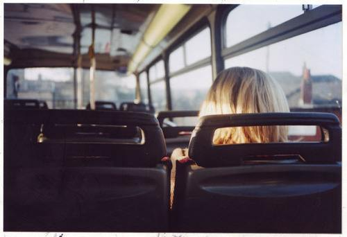
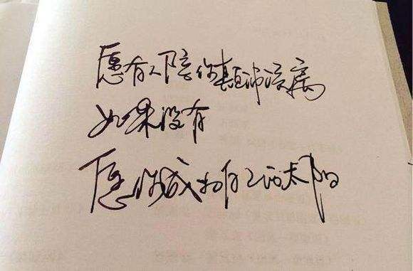
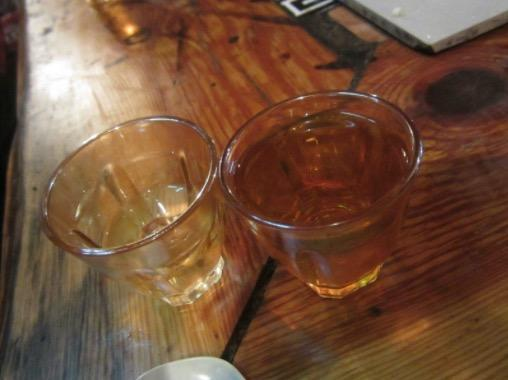
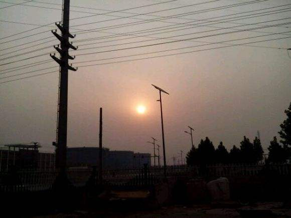
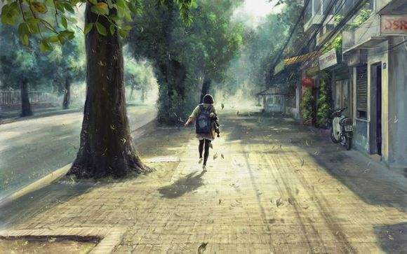
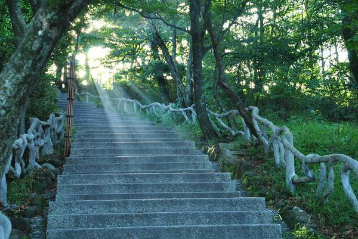
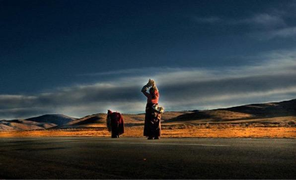
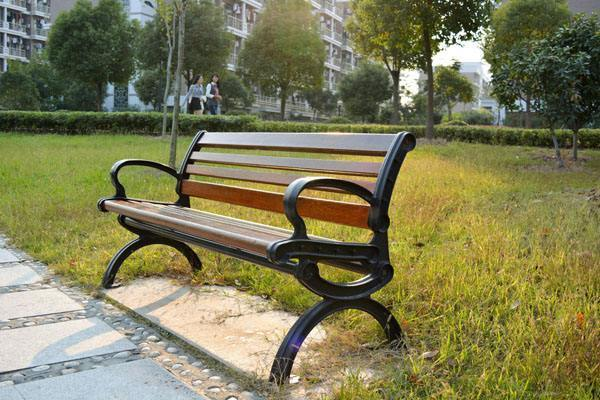

还依稀记得毕业那年春天，自己时常自徘徊在郑州的陇海路和桐柏路的日子，记得在西环柿园的那些独自一人的岁月，那时候临近毕业，学校有毕业设计的论文要交，自己的经济状况也相当拮据，这些还不是最要命的，我最关心的还是看不到未来的那种彷徨和无助感。
<!--more-->

那时偶尔会碧沙岗公园里转转，郑州这个城市我去过最多的地方，就是碧沙岗公园，前年的清明节我自己又去了碧沙岗公园，独自一个人坐在长凳上，想着那时候的自己，也是这样，去年的三月底，我有幸再次去了这个城市，和朋友约了晚上六点见面，上午就到了这个城市，闲来无事，我又去了以前待过的地方，听说柿园被拆了，没有去看，不过去了国棉六厂的那条小巷子，路边的那些小饭店还在，中午我也点了一碗特色的烩面，还特意要了一瓶啤酒。声音嘈杂的空间里，自己一个人总是能隐约看到几年前门外街巷里徘徊的那个自己。

毕业那年春天，我总是每天下班的路上自己要走很远很远，回到住的地方也是一个人，面对着空空的房间，恍然的不知所措，那时候总是想走设计这条路，从小就感觉长大了自己注定了不平凡，临近毕业，才感觉想找一个和专业相关的职业谋生竟是如此的艰难，后来，室友也来了郑州，那些天我还是很忙，有时候一天有好几场婚礼，前一天晚上要布置好几个场景，忙到深夜，每次晚归，走在狭窄的箱子里，带着满身疲惫的身躯和一颗不屈的奋斗的心。

后来，室友几次面试屡感不顺，就想了另取谋生之道，改去山东做销售代理，中间的情节我记不大清，只是记得那几天，我依旧忙的一塌糊涂，白天要帮着店里干杂活，还要采集带子，我开始自己做带子了，开始用Edius，夜晚时分便去布置各种场景，第二天婚礼，我便有时候负责现场的督导，有时候负责现场的音响。有时候为了省钱，几个人挤在货车的后面，那时候最怕遇到堵车，记得有次去农业路那边，路过文化路，整整延误了两个小时，自己在车里热的满头大汗，闷得一种难以描述的煎熬。透过前面的驾驶室的玻璃看着外面那些和我几乎同龄的学生，突然觉得毕业像是一场逃荒，大家各自散去的逃荒。

他离开的前一天晚上，我大概两点多到了那个熟悉的巷口，远处路上时而不时飞奔过一辆大货车，箱子里的几家LED的招牌还在黑夜里闪烁，还好有个24小时的便利店开着门，我摸出了兜里仅有的二十几块钱，买了四罐啤酒，回到屋里，室友也醒了，我俩深夜饮酒，说着毕业的种种，说着理想，说着都要好好混，说着改日再聚。

每个人其实都没有活出自己最初期待的样子，后来各种偶然机缘巧合下，我选择了北上，我又一次去了同学那边，那是个下雨的下午，同学还在上班，没有回来，我也不想他送我，送别场面总是充满着不舍和留恋，而我除了这些更多的还有对未来的不可知。我根据同学电话的描述，找到了钥匙，然后取了我的行李，然后淋着淅淅沥沥的雨，离开了这个挣扎生活了几个月的城市，火车一路北上，飞奔着，我在车上靠着窗户，睡着了。

BOEDT开始的日子是新鲜的，是觉得好奇的，有着车接车送的日子，自然就有了大片的时间思考，有了大片的时间回顾，那时候差点遇到爱情，生活真的蛮奇怪的，后来的几年，我都以为自己遇到了爱情，后来才发现那只是一个充满着幻想的棉花糖。记得平安夜的火车开车前的候车厅，我一个人绕着那个二楼的楼梯徘徊，后来的后来就开始了我后来的生活，有时候我们都是懒惰的，懒惰的不想改变，不想跳出自己的圈子。

生活总是在你将要睡着的时候，是时候的叫醒你，让你继续前行。那年的春节和一帮同龄人在北京的小屋里吃着年夜饭，记得还有一瓶他们从老家带来的酒，那一年是大雪，记得大家每次做完Clean 回来的路上都是踏着积雪，他们一路说笑，而我却知道，我要离开，离开那个不属于我的地方，春天的风刚刚吹醒地里的深埋的种子，我和室友一起从大兴拎着行李往海淀这边提，那天，突然有了和我那天提着行李冒着雨郑州赶火车的感觉，一样的迷茫，一样的未知，一样的充满力量。

对一个外来的人，要想在这个城市活下去，就得一点点的挣出想要的梦想，一步步的走出脚印。我不否认有些人的努力和运气很值得肯定，很快他们遇到了他们想要的生活，于是，开始慢慢和这个城市和解。而对于那些还没有遇到自己想要的生活的人，一直再通往的道路上挣扎努力，有过疲惫，有过不堪，但是没有想过放弃，一个人可以被毁灭，但是不会被打败。而我正是这样的一群人里的的一个，没有想过放弃，一直在用自己的脚步，追逐自己的梦想。

时间好像一晃，就晃了七年，七年这个很特别的时间，可以让两个不认识的人，携手走到一起，也可以让一段甜蜜的婚姻遭遇危机，可以让一个懵懵少年变的精于世故，左右逢源，也可以让一个意气风发，朝气蓬勃的青年向现实低头。可以让一个人变成了当初最看不起的那个人，也可以让一个人理想的路上开出几朵灿烂的花。

生活里，我依旧没有做那个沉默的大多数，依旧怀揣着自己的特立独行的理想，这些年我尽力在守护，还是不免遭受了许多的风吹雨打。生活里，我依旧没有屈服于任何人，依旧有着自己的处世观，依旧在自己的这条路上渐行渐远，选择还是努力，有时候不是个单选题，有时候你选择了选择，还得选择努力。七年前我能在街头巷尾的路上追着理想，而如今我很庆幸依旧跟着理想的脚步前行。

现在的日子，我最怕过的没有感觉，最怕过的记不住，子曰：“君子不器”，人总是要活出点生趣的，那些为了自由或爱情而和周围抗争的人，我都认为他们有着坚强和勇敢。如今的人们还要不要在自己的青春的路上开出几朵花？很多人在看了《人民的名义》之后，有的不是对正义的代表的沙瑞金和侯亮平的推崇，更多的人反而对祁同伟和高小琴有了更多的兴趣，他们身上都有着努力和奋争的烙印，而最终还得向现实屈服，而那些生活里不够努力和没有屈服的人只是过出了大风厂职工的生活，祁同伟一直要胜天半子，而大风厂的职工却只能命运交由他人主宰。

有人说，你明知道没有结果，干嘛还要说出来，再说你的情况不至于这样糟糕，你看，别人都不说话，就你一个人在那里争取，多不明智。我笑着回答，为自己的立场和自由和这个世界抗争过，有什么明智不明智的。记得美国波士顿犹太人纪念碑上一段德国新教神父马丁的文字：

起初他们追杀共产主义者，我不是共产主义者，我不说话；

接着他们追杀犹太人，我不是犹太人，我不说话；

后来他们追杀工会成员，我不是工会会员，我继续不说话；

此后他们追杀天主教徒，我不是天主教徒，我还是不说话；

最后，他们奔我而来，再没有人站起来为我说话了。

这次你的双休没了，下次你的加班补休没了，下下次你的法定节假日泡汤了，不远的将来，你成了别人实现理想的工具！要小心那些让你All IN 的人，如果我们不去维护正义和公平，下一个受害者可能就是你我。最后的奋争的结局不一定是期待的那样，没关系，依旧向世界宣示，没有被屈服，要知道自己还活着。困难就像海边的那一颗颗礁石，阻碍着水流，而我们就等着下一次风起的时候，奋力而上，再一次击打出美丽的浪花。

或许下一次去郑州的时候，依旧会去碧沙岗公园看看，看看公园里池塘的那些红鲤鱼，仔细那个坐在长凳上闲聊的人，体味公园的海棠花开，满园芬芳沁人心脾的感觉，或许还能中午和同事小涛谈论理想的瞬间，说不定是和坐在小凳子上和算命先生侃侃而谈人生中是命重要还是运重要的青年。

